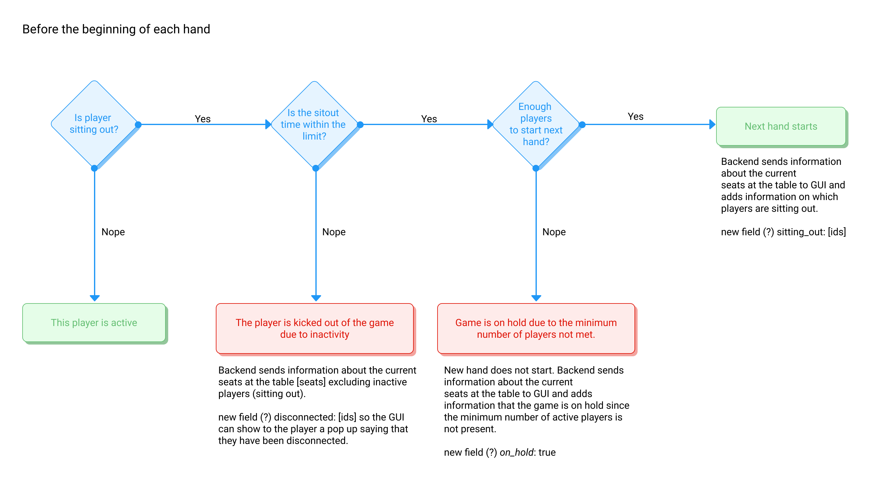

# Sitout

# Implementation

The dealer should be allowed to set the table number.
E.g they set 6/9 (max of 9 players, minimum of 6). 
If there are 5 players, the hand doesn't start. If there are 6,7,8,9 players, the hand starts. 
This # of players does not include players that are 'sitting out'.

A player should only be able to sit out for a set amount of hands/time. People should have the option to sit out for comfort breaks. But people shouldn't be allowed to sit out for prolonged periods of time.

## Alpha (Current implementation, showcase)

The hand is in progress. Player 1 checks "Sitout the next hand". After the hand finishes, Player1 sits out. Currently the seat is not reserved by the player 1, that will be included in the beta version. Technically player 1 is out of the game, but their node is not disconnected, it is waiting for them to decide to join again. Their seat is available for other player to join. Player 3 joins the game, takes the vacant seat, the game starts again, since the condition of minimum of 2 players has been met.

If the player 2 wants to join the game again he needs to wait for player 3 to sitout.

This current implementation is more of a showcase that it is implementable.

## Beta

Player's seat is reserved by the player when he sits out. The hand starts if the minimum number of players not including the ones sitting out is met. Player can join back in the game when he decides to stop sitting out.

