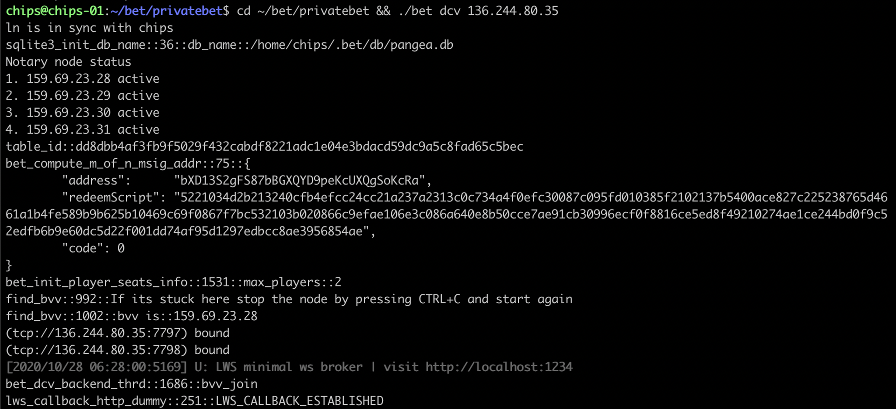
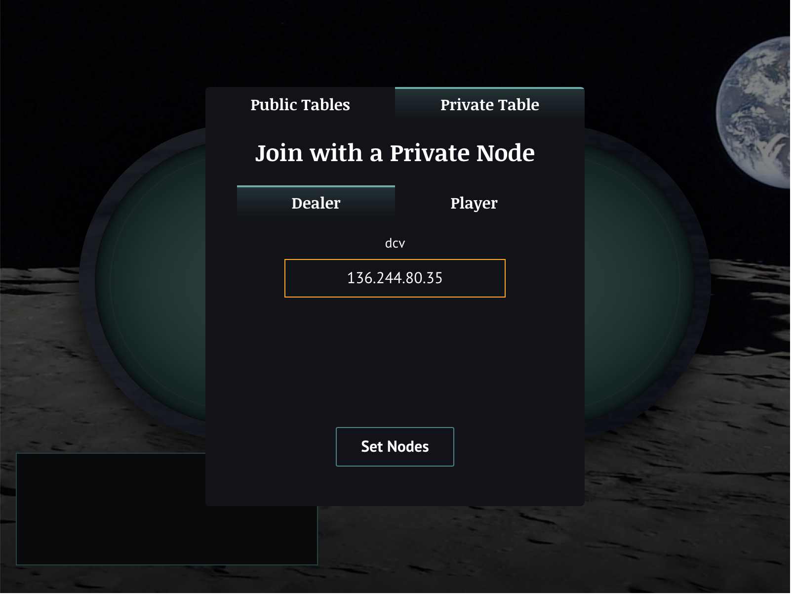
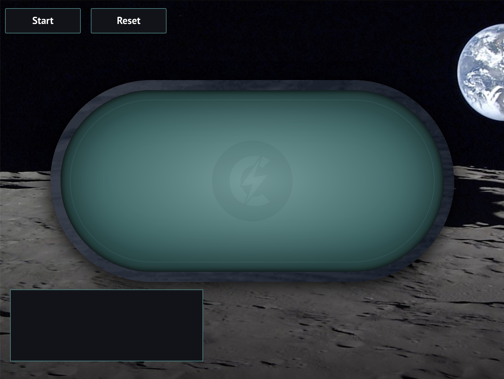
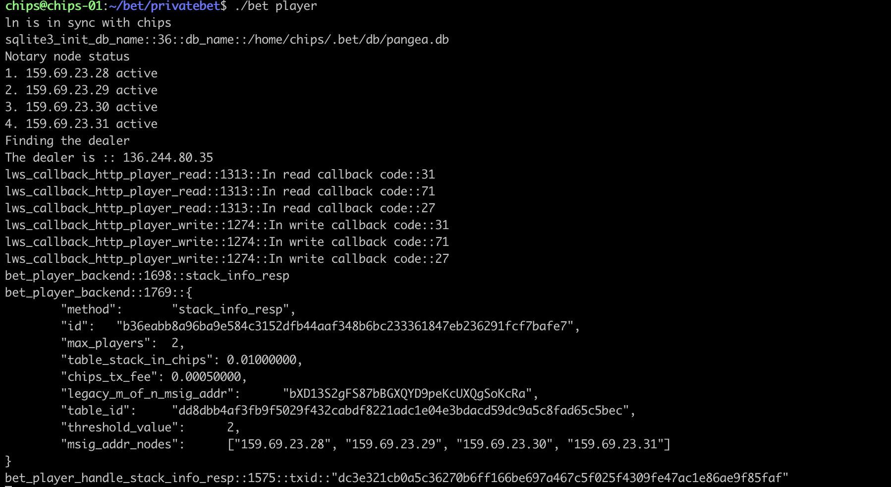
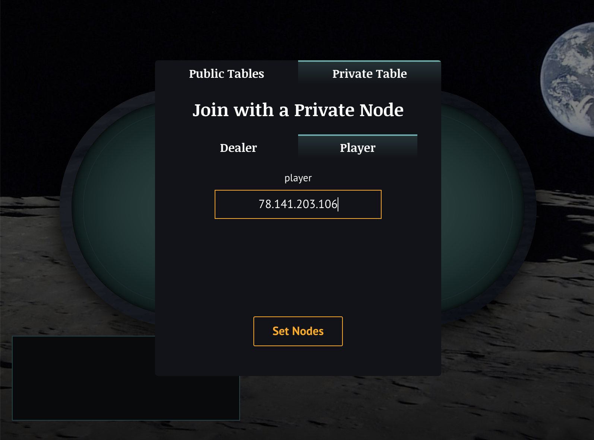
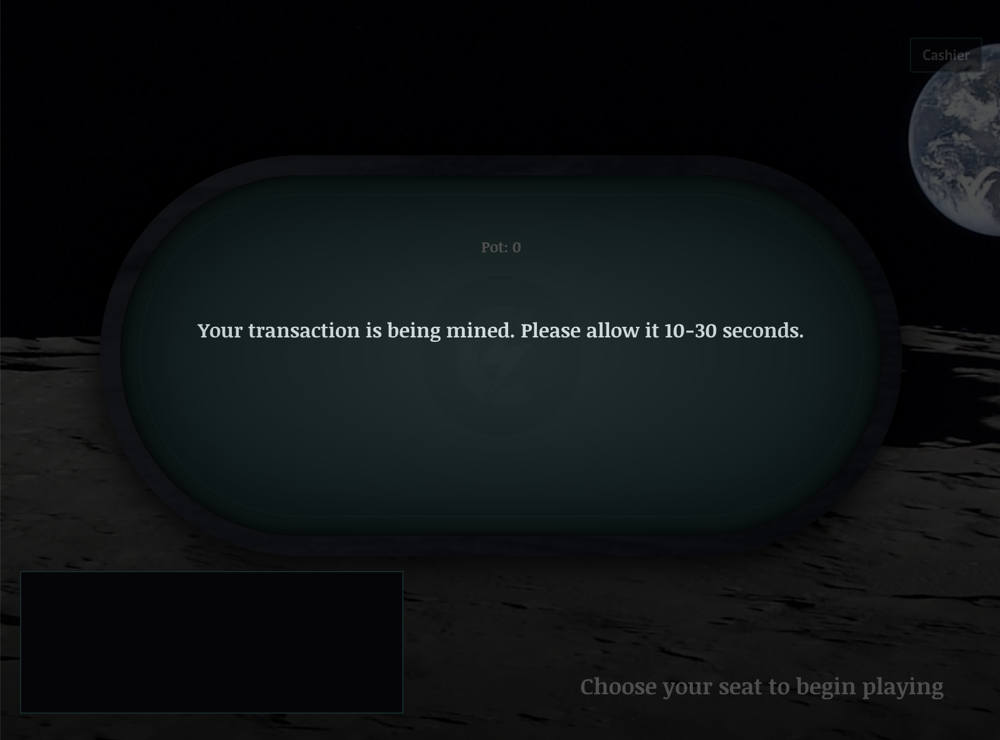

# Pre-Alpha Pangea Poker Tutorial

This is a tutorial on how to play Pangea Poker. It is assumed that you have already performed the installation of the project and are ready to proceed. If you have not installed the project yet please follow this [Guide](https://github.com/chips-blockchain/bet/blob/master/docs/HowToPangea.md) first.

## Check that you are ready to go

In order to play a game of poker using Pangea one needs:

1. Publicly available IP for your player/dealer node.
2. Setup CHIPS, LN and BET.
2. Have CHIPS and LN synced.
3. Run your own player node on a remote server with publicly accessible IP.
4. Run a dealer node or have someone run a node for you. The dealer node facilitates the game and creates a table. (Ask in Discord about this)
5. Run a cashier node or have someone run cashier nodes you can connect to. (Ask in Discord about this)
6. Have access to GUI. Can run it locally or access it at http://dev.chips.cash.

## Good to know 

http://dev.chips.cash has the latest playable version of the GUI. It points to the `dev` branch at the moment. 

To enter the game using GUI you will only need to know your own player node IP.

Player, dealer, cashier nodes are run by [bet](https://github.com/chips-blockchain/bet).

## 1. Dealer node

Feel free to skip this if you dont want to run your own dealer node (you dont have to if someone else is already running it). You can always ping us in Discord and we will run a dealer node for you so you can try the game out.

To run the dealer node:

`cd ./bet/privatebet && ./bet dcv the-dealer-ip`

You should see something like this:

If it seems like it is working, head to GUI and enter your dealer IP to open the dealer GUI.

The dealer GUI does not have much functionality at the moment. It is important to keep it open for the game to function properly at the moment. You do not need to press start as the game starts automatically.

## 2. Player node

To run the player node:

`cd ./bet/privatebet && ./bet player`

The player automatically searches for the available dealer and connects to them. So make sure you are only running one dealer node. This functionality will change in the future and players will be able to specify the dealer they want to connect to.

If the player has successfully connected to the dealer you will see this.

Note that there is transaction information `:txid::"dc3e321cb0a5c36270b6ff166be697a467c5f025f4309fe47ac1e86ae9f85faf"` This transaction is your payment for entering the table, the buy in. You can check the transaction in the explorer. 

Now head to the GUI and enter you player node ip.

You will either be allowed to the table straight away or you will have to wait a little bit for your transaction to be mined.

> Please note, there could be a delay in communication between the player node and the GUI or between dealer nodes and player nodes, so the game might seem a bit slow. The best you can do is wait and take note if something took particularly long and provide us feedback. Thank you.

## FAQ

### The game seems to be frozen

Ah, it could be frozen. Wait a little bit, maybe 30 seconds or so and if nothing happens, something probably went wrong. Check the terminal output for your player node too in case there are any clues to what is going on.

To restart the game.

1. Stop all player nodes and dcv.
2. Re-run dcv
3. Re-run player nodes
4. Make sure the nodes found the dealer.

### I refreshed the GUI and when I enter back I cant do anything

Ah, unfortunately you kindda fell out of the game :) Gotta restart everything and re-join.
